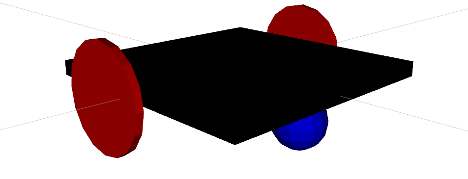
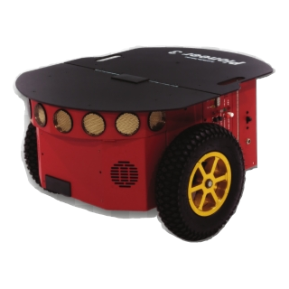
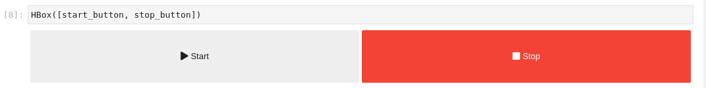
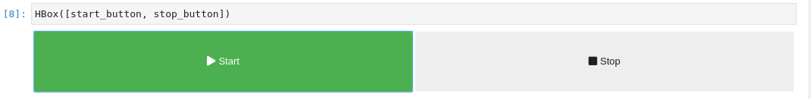

<a href="https://unige.it/en/">

</a>


# First Assignment of the Research Track 2 course (Robotics Engineering / JEMARO, Unige)

**Author's Name: Omotoye Shamsudeen Adekoya**

**Student ID: 5066348**

---

<div align="center">
<h1> Robot Controller </h1>

</div>

>This package contains the nodes and the simulation environments for controlling a mobile robot in the Gazebo simulation environment and CoppeliaSim simulation environment.

# ROS Package Description 
There are three branches in this GitHub repository; _**master, action**_ and _**ros2**_, each of these branches controls the mobile robot in their unique way and it would all be described below. 

## General Package Architecture Description 
The architecture is contained of **four** nodes; 

*   _**user_interface**_
*   _**random_position**_
*   _**state_machine**_
*   _**go_to_point**_   

### User Interface (_user_interface.py_)
This node prompts the user to enter an integer that represents either a start of the robot motion simulation or a stop of the simulation. Based on the input gotten from the user, the node sends a service request of either **start** or **stop** to the user_interface server in the state_machine node.

### Random Position (_random_position.cpp_)
This node takes in a request from the state machine with a minimum and maximum x and y coordinate message and from this request message it then generates a random position within that range and sends it as a response to the state machine. 

### State Machine (_state_machine.cpp_)
The state machine is in charge of transitioning the system state from one state to another (_i.e from start to stop and vice versa_). The state machine takes in a request of start or stop from the user_interface client and then based on the request message it then either sends a request to the random position server for a random position or it sends a request to the go to point server to stop the robot from going to some given point. If the request is to start the robot, after getting a response of a random target pose from the random position node, the state machine sends the random pose coordinates as a request message to the go to point server and waits until the service goal is completed. 

### Go To Point (_go_to_point.py_)
This node takes a service request of a target pose coordinate message from the state machine and then navigates the robot from its current position coordinate to the required target position coordinate. 

These are the basic functions of the nodes contained in the **master** branch of this repository, for more information about the code contained in the nodes of the master branch [Click Here](https://omotoye.github.io/rt2_assignment1/ "Script code HTML Documentation"). The **action** and **ros2** branch make minor changes to these nodes for some specific reason which would be described below. 

---

## Action Package Description

The action branch which can be found in this [link](https://github.com/Omotoye/rt2_assignment1/tree/action) makes some little changes to the **state_machine** and the **go_to_point** nodes. In this branch, the __service client server__ communication between the _state machine_ and the _go to point_ node is replaced with an __action client and server__. This is because, in the previous version contained in the __master__ branch, the service request to stop the robot's motion between random positions is asynchronous _i.e the system has to wait for the robot to reach the target before the random target behavior can be stopped_. The problem with the service implementation can be solved with an action server, this is because action servers allow their goal to be **preempted**. Therefore in this node, the robot is stopped immediately after a request to stop has been given. A function was implemented in the go to point node to check if a preempt request has been activated, this function is checked on every loop of velocity command sent to the robot. The code snippet is below. 
```python 
def check_preempt():
    """This function is used for checking if a preemption has been
    requested from the UI node. 

    Returns:
        [bool]: True if preempt is request and False otherwise. 
    """
    # check that preempt has not been requested by the client
    if _as.is_preempt_requested():
        print('The Goal has been Preempted')
        _as.set_preempted()
        done()
        return True
    return False
```

---

Also the structure of the **Position.srv** message sent between the node was changed to the format required by the action by the action server, **Position.action**. 
```diff
-   float32 x
-   float32 y   #request
-   float32 theta
-   ---
-   bool ok   #response

+   float32 x
+   float32 y     #goal
+   float32 theta
+   ---
+   bool ok  #result
+   ---
+   nav_msgs/Odometry pose #feedback
```


## ROS2 Package Description

This package does exactly the same thing that the package in the master branch does, the only difference is that it does part of it with **ros2**,  [click here](https://github.com/Omotoye/rt2_assignment1/tree/ros2) to go to the ros2 branch. The package in both the **master** and **action** branch is written specifically for **_ROS Noetic Ninjemys_**. The package in the **ros2** branch allows some parts of the simulation (**state_machine and random_position is controlled from ros2**) to be controlled from a *__ROS 2 Foxy Fitzroy__* package. This is made possible by a package called [ros1_bridge](https://github.com/ros2/ros1_bridge "ros1_brige"), this package helps to bridge the messages from a **ros2** package with messages in **ros** package which then enable communication between the nodes of the package. _Instructions on how to compile and launch the ros1_brige can be found in the readme contained in the ros2 branch; **all required configurations have already been made to the package**_.

## The CoppeliaSim Simulation Scene
<div align="center">

</div>

A CoppeliaSim scene can also be found in this package (**exclusive to master/action branch**), this scene contains a Pioneer Mobile robot which can be controlled with the same controller used for the **Gazebo Two-Wheeled Robot**, the pioneer robot controller script has been written in such a way that is can be controlled with the nodes of this package, however, the script does not allow a single **cmd_vel** velocity command for moving the robot about the simulation; for this reason, an additional python script is added for publishing the required velocity command when using the CoppeliaSim scene for the simulation. The script is called **_pioneer_velocity_publisher.py_**. Information about the script is given below.

### Pioneer Velocity Publisher (_pioneer_velocity_publisher.py_)
This node subscribes to the **cmd_vel** command coming from the go to point node, it then determines the required velocity that should be published to the velocity topics (**_/leftwheel_vel, /rightwheel_vel_**) connected to the wheel of the pioneer robot. The callback function below describes the script better. 

```python
def handle_wheel_velocity(msg):
    """This is a callback function that takes in the cmd_vel command from the go to point
    node and then interprets it to the required velocity for each of the wheels of the pioneer robot

    Args:
        msg ([Twist]): Linear and angular velocity command from the go to point node
    """
    global vel_l, vel_r
    if (msg.linear.x > 0 or msg.linear.x < 0):
        vel_l.data = msg.linear.x 
        vel_r.data = msg.linear.x 
    elif(msg.angular.z > 0):
        vel_l.data = msg.angular.z
        vel_r.data = -(msg.angular.z)
    elif(msg.angular.z < 0):
        vel_l.data = -(msg.angular.z)
        vel_r.data = msg.angular.z
```

# New Package Version Release
The next iteration of this project can be found in [Second Assignment of the Research Track 2 course](https://github.com/Omotoye/rt2_assignment2). This package is built from the **action** branch of this repository. it includes a **Jupyter Notebook** notebook that the user can use for the **control** *of the robot and the* **visualization** *of the state of the robot.* It features things like buttons for starting and stopping the robot, a control pad for directly moving the robot, and several plots for visualizing the state of the robot. The picture below is attached to give a preview of what to expect from the package. 

<div align="center">



<strong> The start and Stop buttons </strong>
</div>

# How to Compile and Launch the Package (*master and action branch*)
**NB**: The instructions below are meant for the **_master_** and **_action_** branch of this repository which is written for _**ROS Noetic Ninjemys**_. To compile and launch the package in the **ros2** branch please consult the readme provided in the [ros2 branch](https://github.com/Omotoye/rt2_assignment1/tree/ros2).

## Compile

First, you create a folder for your catkin workspace

```bash
mkdir -p ~/catkin_ws/src
```

Clone the package repository

```bash
cd ~/catkin_ws/src
git clone https://github.com/Omotoye/rt2_assignment1.git
```
If you want to work with the action branch 
```bash
cd ~/catkin_ws/src/rt2_assignment1
git checkout action 
```

Once the package has been successfully cloned, you then build the workspace

```bash
source /opt/ros/noetic/setup.bash
cd ~/catkin_ws/
catkin_make
```
### More commands for using the CoppeliaSim Scene 
[Click here](https://www.coppeliarobotics.com/downloads) to download the CoppeliaSim software. Unzip the package and put the folder preferably in the home directory (*you can put the folder anywhere*). 


## Launch

Step one, source the setup.bash file, if you followed the steps above, then you can enter the command below.

```bash
source ~/catkin_ws/devel/setup.bash
```

If you didn't follow the initial steps because you already have a workspace, trace a path from your home directory to your catkin workspace down to your setup.bash file. An example is shown below, **_THIS WILL NOT WORK FOR YOU, IT IS JUST AN EXAMPLE TO SHOW HOW IT CAN BE DONE_**

```bash
source /home/omotoye/catkin_ws/devel/setup.bash
```
### For Gazebo Simulation

There is only one launch file to start the gazebo simulation, state machine, and the random position server node. Enter the command below to launch the node for the gazebo simulation.

```bash
roslaunch rt2_assignment1 sim.launch
```

### For CoppeliaSim Scene 
There is a launch file for launch all the required nodes for the coppeliasim scene, however, the coppeliasim software cannot be run through a ros launch file, so some extra steps would be taken for that. 

First, you run the **ros master** so the ros plugin can be loaded successfully when launching the CoppeliaSim software. Run the command below to do that. 
```bash 
roscore & # the & symbol allows the process to be run as a background process  
```
Navigate into the directory of the CoppeliaSim folder, if you put it on your home directly as advised, enter the command below, otherwise cd into the folder from where ever you put it and run the launch script with the second command below. 
```bash
cd ~/CoppeliaSim_Edu_V4_2_0_Ubuntu20_04
./coppeliaSim.sh
```
After launching the CoppeliaSim software, click on **File/Open Scene** and then navigate to the path of the scene which is in the **CoppeliaSim-Scene/pioneerROS.ttt** inside this repository that you cloned (**master or action branch**). Press the Play button to start the simulation then enter the command below to launch all the required node for the simulation. 
```bash
roslaunch rt2_assignment1 pioneer_sim.launch
```
Follow the instructions from the command line User Interface. 


